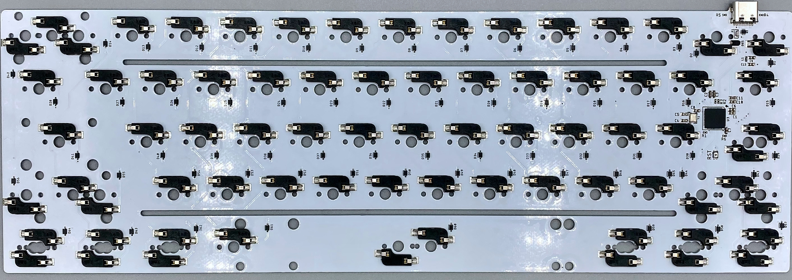
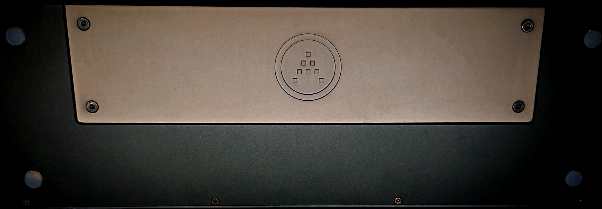
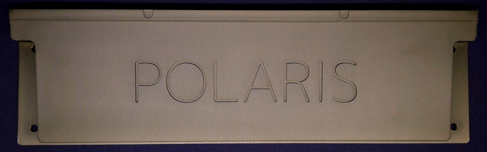
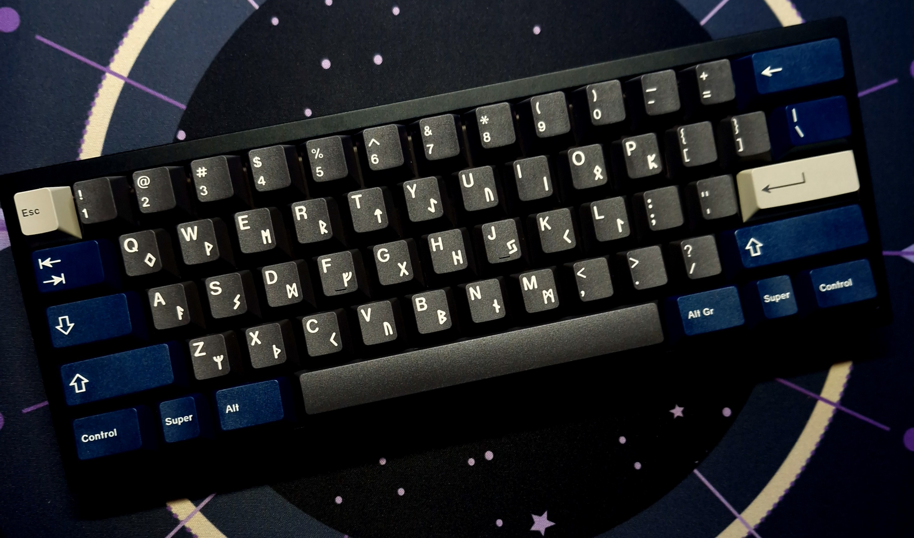
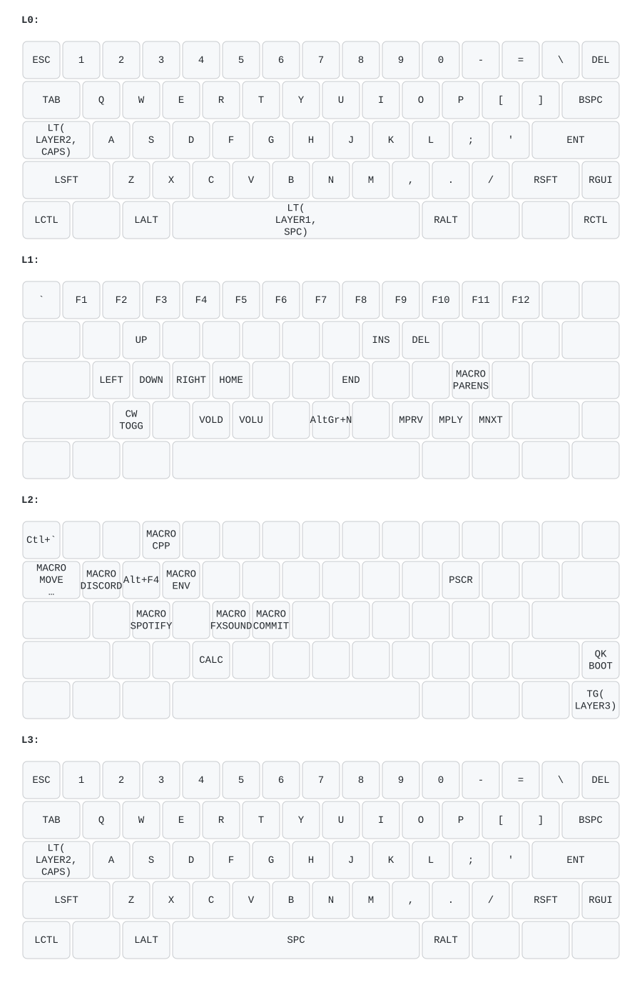

# QMK Configuration
Keyboard configuration using the polaris hotswap pcb by FjLaboratories

## Weight

## Keyboard

## Keymap / Layers
Key layout from the `keymaps/keymap_split/keymap.c` configuration

